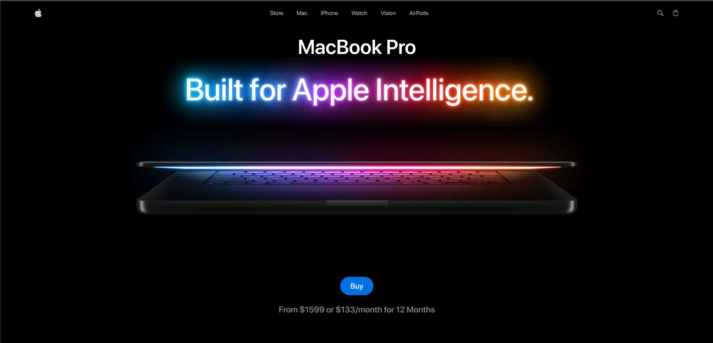
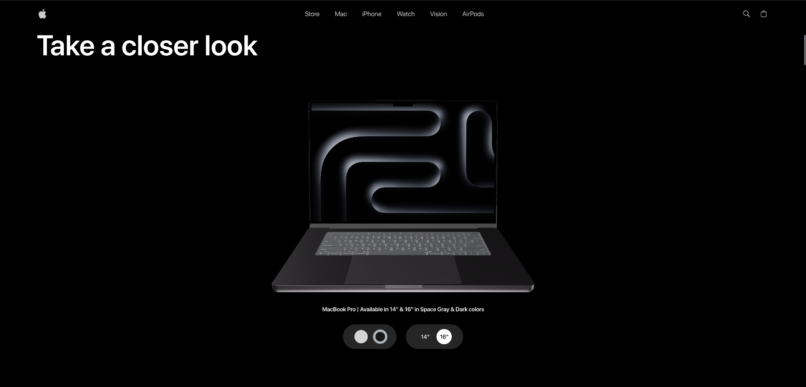
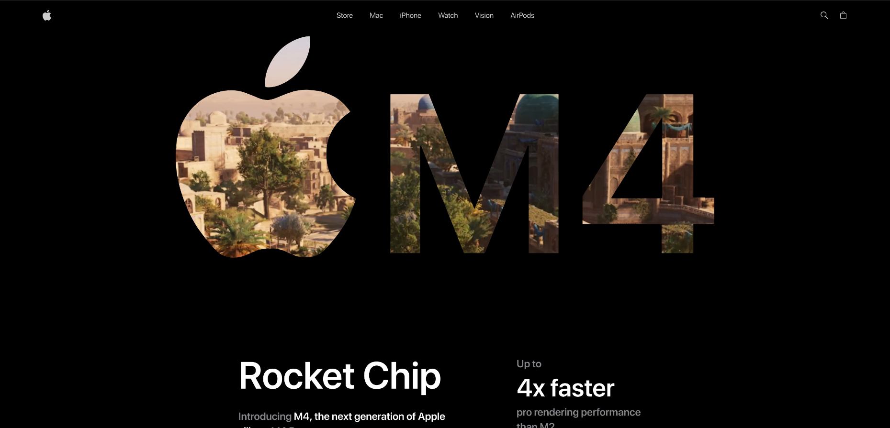
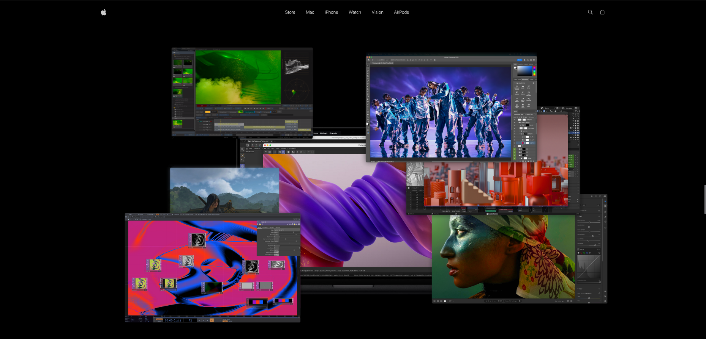
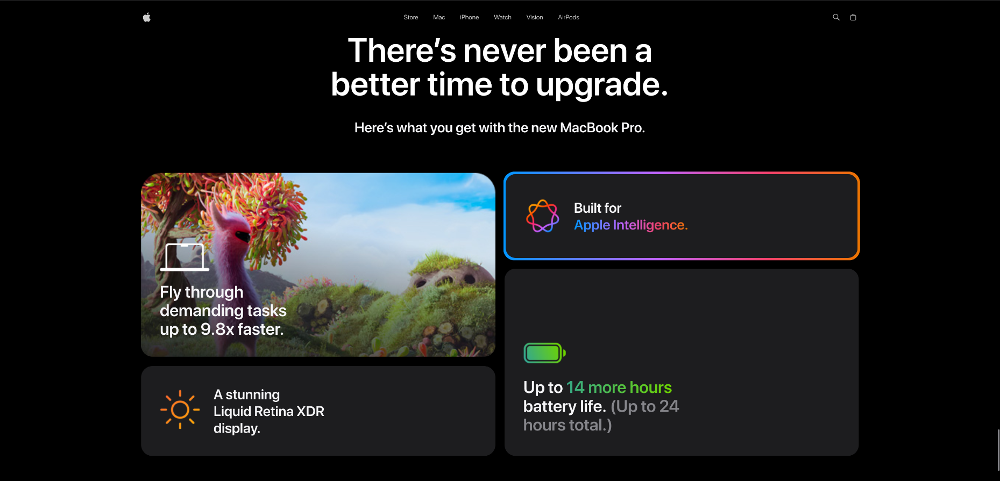

# 🍎 MacBook Pro Showcase - GSAP Animation Project

A stunning, interactive MacBook Pro showcase website featuring cutting-edge animations powered by GSAP (GreenSock Animation Platform), React Three Fiber, and Tailwind CSS. This project demonstrates advanced web animation techniques with smooth parallax effects, 3D model interactions, and immersive scrolling experiences.


## 📸 Screenshots

### Hero Section


_MacBook Pro landing page with animated title and video background_

### 3D Product Viewer


_Interactive 3D MacBook models (14" & 16") with color customization_

### Showcase Section


_M4 Chip features with video mask animation_

### Performance Section


_Multi-layer parallax effects with performance images_

### Features Section


_AI-powered features with animated 3D models_

### Highlights Section


_Product highlights in a masonry grid layout_

---

## ✨ Key Features

### 🎬 Advanced GSAP Animations

- **ScrollTrigger Integration**: Animations triggered by scroll position
- **Timeline Animations**: Complex sequenced animations
- **Parallax Effects**: Multi-layer depth animations with different scroll speeds
- **Smooth Scrubbing**: Direct scroll-to-animation linking

### 🎨 Interactive 3D Models

- **React Three Fiber**: WebGL-powered 3D rendering
- **Interactive Controls**: Rotate, zoom, and explore MacBook models
- **Model Switching**: Smooth transitions between 14" and 16" models
- **Material Animations**: Dynamic opacity and fade effects

### 🖼️ Visual Effects

- **Multi-Layer Parallax**: 6+ different scroll speeds for depth
- **Rotation Parallax**: Dynamic rotation based on scroll
- **Scale Animations**: Zoom effects for emphasis
- **Blur & Focus**: Depth-of-field effects
- **Opacity Transitions**: Smooth fade in/out animations
- **Center Spotlight**: Dramatic entrance/exit for featured content

### 📱 Responsive Design

- Mobile-first approach with Tailwind CSS
- Breakpoint-specific animations
- Touch-friendly interactions
- Optimized for all screen sizes

### 🎯 Performance Optimizations

- GPU-accelerated transforms
- Efficient scroll listeners
- Lazy loading of assets
- Optimized 3D model rendering

---

## 🛠️ Tech Stack

### Core

- **React 19.1.1** - UI framework
- **Vite 7.1.7** - Build tool and dev server
- **JavaScript (ES6+)** - Programming language

### Animation & 3D

- **GSAP 3.13.0** - Professional-grade animation library
- **@gsap/react 2.1.2** - React hooks for GSAP
- **React Three Fiber 9.4.0** - React renderer for Three.js
- **@react-three/drei 10.7.6** - Useful helpers for R3F
- **Three.js 0.181.0** - 3D graphics library

### Styling & UI

- **Tailwind CSS 4.1.16** - Utility-first CSS framework
- **@tailwindcss/vite 4.1.16** - Tailwind Vite plugin
- **clsx 2.1.1** - Conditional className utility

### State Management

- **Zustand 5.0.8** - Lightweight state management

### Utilities

- **react-responsive 10.0.1** - Media query hooks

---

## 📦 Installation

### Prerequisites

- Node.js (v18 or higher)
- npm or yarn

### Steps

1. **Clone the repository**

```bash
git clone https://github.com/AshimChoudhary/Macbook_GSAP.git
cd Macbook_GSAP
```

2. **Install dependencies**

```bash
npm install
```

3. **Start development server**

```bash
npm run dev
```

4. **Open in browser**

```
Navigate to http://localhost:5173
```

---

## 🎯 Available Scripts

| Command           | Description                              |
| ----------------- | ---------------------------------------- |
| `npm run dev`     | Start development server with hot reload |
| `npm run build`   | Build for production                     |
| `npm run preview` | Preview production build locally         |
| `npm run lint`    | Run ESLint for code quality              |

---

## 📂 Project Structure

```
Macbook_GSAP/
├── public/
│   ├── fonts/              # Custom fonts
│   ├── models/             # 3D model files (.glb)
│   ├── videos/             # Video assets
│   └── *.png/svg           # Images and icons
├── src/
│   ├── components/
│   │   ├── models/         # 3D model components
│   │   │   ├── Macbook-14.jsx
│   │   │   ├── Macbook-16.jsx
│   │   │   └── Macbook.jsx
│   │   ├── three/          # Three.js utilities
│   │   │   ├── ModelSwitcher.jsx
│   │   │   └── StudioLights.jsx
│   │   ├── Features.jsx    # AI Features section
│   │   ├── Footer.jsx      # Footer component
│   │   ├── Hero.jsx        # Landing hero section
│   │   ├── Highlights.jsx  # Product highlights
│   │   ├── Navbar.jsx      # Navigation bar
│   │   ├── Performance.jsx # Performance section with parallax
│   │   ├── ProductViewer.jsx # 3D product viewer
│   │   └── Showcase.jsx    # M4 chip showcase
│   ├── constants/
│   │   └── index.js        # App constants and data
│   ├── store/
│   │   └── index.js        # Zustand store
│   ├── App.jsx             # Main app component
│   ├── index.css           # Global styles
│   └── main.jsx            # App entry point
├── index.html
├── package.json
├── vite.config.js
└── README.md
```

---

## 🎨 Animation Sections

### 1. Hero Section

- Video playback animation
- Text fade-in effects
- Call-to-action button animations

### 2. Product Viewer

- 3D model rendering
- Interactive presentation controls
- Model switching with slide animations
- Color picker with active states
- Size selector (14" / 16")

### 3. Showcase Section

- Video mask animation
- Text reveal on scroll
- Opacity transitions
- Multi-column layout animations

### 4. Performance Section

**11 Different Animation Types:**

1. Multi-layer vertical parallax (6 layers)
2. Horizontal parallax drift
3. Rotation parallax (±5°)
4. Scale depth effect
5. Opacity fade transitions
6. Blur-to-focus effect
7. Center image spotlight (p5)
   - Dramatic zoom in/out
   - Rotation entrance/exit
   - Blur and brightness effects
   - Continuous glow effect
   - Pulsating scale animation

### 5. Features Section

- 3D model showcase
- Feature cards animation
- Icon animations
- Scroll-triggered reveals

### 6. Highlights Section

- Masonry grid layout
- Staggered card animations
- Gradient effects
- Hover interactions

---

## 🔧 Configuration

### Vite Configuration

```javascript
import { defineConfig } from "vite";
import react from "@vitejs/plugin-react";
import tailwindcss from "@tailwindcss/vite";

export default defineConfig({
  plugins: [react(), tailwindcss()],
});
```

### Tailwind Configuration

Custom theme with:

- Custom fonts (Regular, Medium, SemiBold, Bold)
- Custom colors (primary, dark, light variants)
- Custom utilities (flex-center, col-center, abs-center)
- Custom components

---

## 🎮 Interactive Features

### 3D Model Controls

- **Rotation**: Click and drag to rotate
- **Zoom**: Mouse wheel to zoom in/out
- **Snap**: Auto-snap to default position
- **Presentation Mode**: Smooth, physics-based controls

### Color Customization

- Space Gray (#adb5bd)
- Midnight (#2e2c2e)
- Smooth color transitions

### Size Selection

- 14" MacBook Pro
- 16" MacBook Pro
- Animated model switching

---

## 🚀 Performance Features

### Optimization Techniques

- **GPU Acceleration**: Using transform3d and will-change
- **Scroll Optimization**: Throttled scroll listeners
- **Lazy Loading**: Models loaded on demand
- **Code Splitting**: Dynamic imports for routes
- **Asset Optimization**: Compressed images and models

### Animation Performance

- **GSAP's gsap.set()**: Instant property updates
- **ScrollTrigger caching**: Optimized scroll calculations
- **useGSAP hook**: Proper cleanup and scoping
- **Dependency tracking**: Animations refresh on state changes

---

## 🎓 Learning Resources

This project demonstrates:

- Advanced GSAP techniques
- React Three Fiber integration
- Scroll-based animations
- Parallax effects
- 3D model rendering
- State management with Zustand
- Responsive design patterns
- Modern React practices

---

## 🤝 Contributing

Contributions, issues, and feature requests are welcome!

1. Fork the project
2. Create your feature branch (`git checkout -b feature/AmazingFeature`)
3. Commit your changes (`git commit -m 'Add some AmazingFeature'`)
4. Push to the branch (`git push origin feature/AmazingFeature`)
5. Open a Pull Request

---

## 📝 License

This project is open source and available under the [MIT License](LICENSE).

---

## 👨‍💻 Author

**Ashim Choudhary**

- GitHub: [@AshimChoudhary](https://github.com/AshimChoudhary)
- Repository: [Macbook_GSAP](https://github.com/AshimChoudhary/Macbook_GSAP)

---

## 🙏 Acknowledgments

- **Apple** - Design inspiration
- **GSAP** - Amazing animation library
- **Three.js Community** - 3D graphics resources
- **React Three Fiber** - Making 3D in React easy
- **Tailwind CSS** - Utility-first CSS framework

---

## 📧 Contact

For questions or feedback, please open an issue on GitHub.

---

<div align="center">

**⭐ Star this repo if you found it helpful!**

Made with ❤️ and GSAP

</div>
